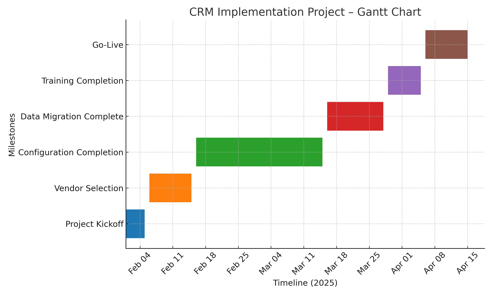
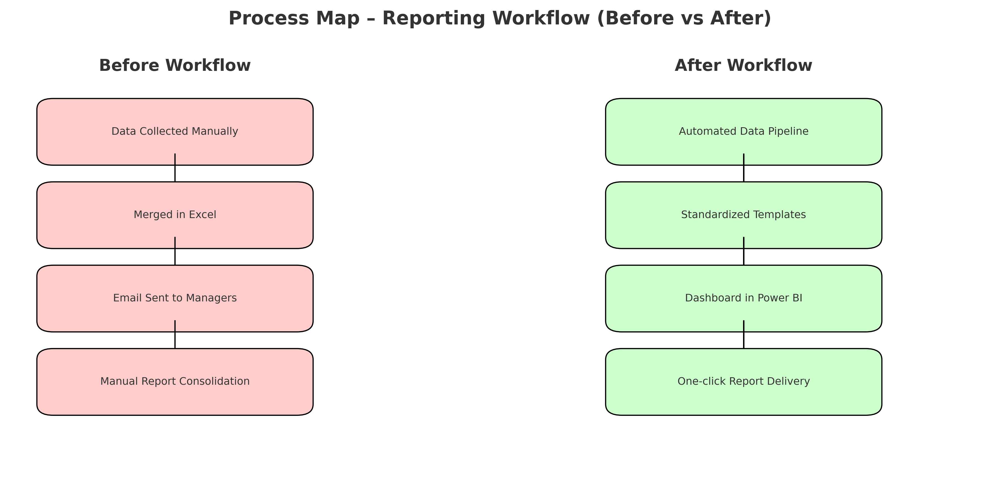

# 📊 Matt Rivera – Project Management Portfolio

Welcome to my Project Management portfolio!  
Here you'll find case studies, project artifacts, and templates demonstrating my ability to plan, execute, and close projects using both Agile and Waterfall methodologies.

---

## 🧩 About Me
- **Certified Associate in Project Management (CAPM)**
- BBA in Computer Information Systems | MS in Business Analytics (in progress)
- Experience with cross-functional project delivery, risk management, and stakeholder communication

---

## 🛠 Skills & Tools
**Project Management:** Agile, Scrum, Waterfall, Risk Management, Budget Tracking  
**Tools:** MS Project, Jira, Trello, Asana, Miro, Confluence  
**Data & Reporting:** Excel (Pivot Tables, VLOOKUP), Tableau, Power BI  
**Documentation:** Project Charters, Risk Registers, Lessons Learned Reports

---

## 📂 Portfolio Projects

### **1. Software Implementation Project**

**Objective:** Implement a CRM system to streamline client onboarding.  
**My Role:** Project Manager – coordinated team of 8, managed $50K budget  
**Highlights:**
- Delivered project **2 weeks ahead of schedule**
- Reduced onboarding time by **15%**
- Managed risks via proactive mitigation plan

📂 [View Project Artifacts](./Project_1_Software_Implementation)

---

### **2. Business Process Improvement Initiative**

**Objective:** Redesign internal reporting workflow to increase efficiency.  
**My Role:** PM – facilitated workshops, documented requirements, tracked progress  
**Highlights:**
- Improved reporting turnaround time by **30%**
- Increased stakeholder satisfaction to **95%**

📂 [View Project Artifacts](./Project_2_Process_Improvement)

---

## 📄 PM Templates
This section includes reusable templates I’ve created:
- [Risk Register Template](./templates/risk-register-template.xlsx)
- [Project Plan Template](./templates/project-plan-template.docx)
- [Stakeholder Analysis Template](./templates/stakeholder-analysis-template.xlsx)

---

## 📬 Contact
- **Email:** matt.rivera@email.com  
- **LinkedIn:** [linkedin.com/in/matt-rivera](https://linkedin.com/in/matt-rivera)  
- **GitHub:** [github.com/yourusername](https://github.com/yourusername)

---
